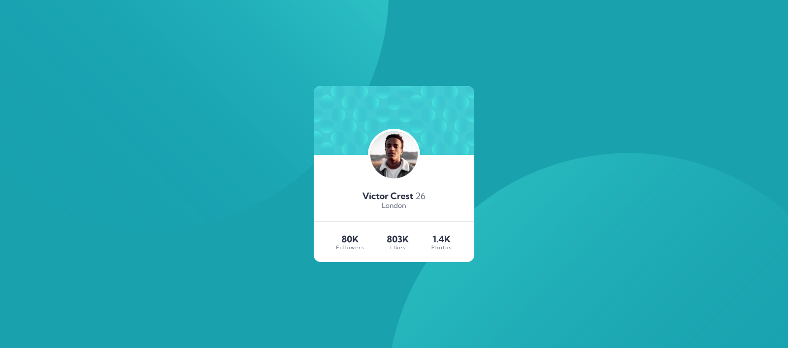

# Frontend Mentor - Profile card component solution

This is a solution to the [Profile card component challenge on Frontend Mentor](https://www.frontendmentor.io/challenges/profile-card-component-cfArpWshJ). Frontend Mentor challenges help you improve your coding skills by building realistic projects. 

## Table of contents

- [Overview](#overview)
  - [The challenge](#the-challenge)
  - [Screenshot](#screenshot)
  - [Links](#links)
- [My process](#my-process)
  - [Built with](#built-with)
- [Author](#author)

## Overview

### The challenge

- Build out the project to the designs provided

### Screenshot

### Links

- Solution URL: [Solution code](https://github.com/nathanieladiah/time-tracker)
- Live Site URL: [Solution site](https://nathanieladiah.github.io/time-tracker)

## My process

### Built with

- Semantic HTML5 markup
- CSS custom properties
- Flexbox
- CSS Grid
- Mobile-first workflow

I created a react app using `create-react-app`. Since there was only a single component for this project I placed it
directly into the `App.js` file.

I wrote standard html markup first, then added styles using `sass`. I used a breakpoint mixin to add responsiveness.

Once it displayed correctly, I refactored it as a React component, passing in prop data to make it reusable.

## Author

- Website - [Nathaniel Adiah](https://nathanieladiah.github.io)
- Frontend Mentor - [@nathanieladiah](https://www.frontendmentor.io/profile/nathanieladiah)
- Twitter - [@nathanieladiah](https://www.twitter.com/nathanieladiah)

## Acknowledgments
